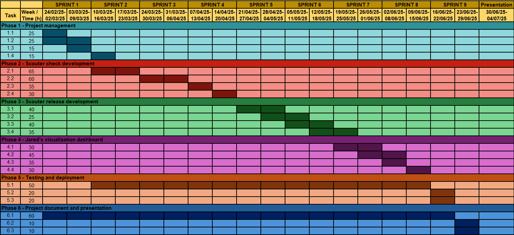

# Planning
The project is expected to take about 720 hours, spread over approximately 125 days, starting from February 17 and continuing until the end of June 2025. The hours dedictaed to the project will be split between hours working at Novartis and hours from personal time such as weekends and after work. The final week will be free of tasks and will serve as a time to refine the project details or in case there are any delays with other tasks.

## Necessary resources
The resources (both human and material) required to carry out the project are specified below.

* **Human resources**:

    * **Project Manager**: The person who will oversee the project and coordinate all tasks.

    * **Development Team**: Developers with experience in software development and Python.

    * **Testing Team**: Responsible for ensuring that the tools are functioning correctly.

* **Material resources**:

    * **Hardware and equipment**: computer, mouse, keyboard and monitor.

    * **Software and tools**: Access to tools such as IDEs, programming libraries, Bitbucket, and Jira will be required.

    * **Workspace**: A workspace with all necessary equipment, including internet and electricity, will be required.

## Description of tasks
The tasks required for the development of the project are identified and described below. These tasks are grouped into categories, and each of the tasks is described in detail, specifying the estimated time in hours that they will take.

### Phase 1 - Project management
To begin with, the project management tasks are described, ranging from scope definition to initial planning, budget and sustainability assessment and weekly monitoring.

* **1.1 - Project scope (25 hours)**: The scope of the project will be defined, which includes the objectives, requirements and obstacles.

* **1.2 - Project planning (25 hours)**: The initial project planning will be carried out. This includes the work structure, tasks definition and the creation of a Gantt chart.

* **1.3 - Resources and budget (15 hours)**: A budget and resource management will be carried out, which involves the identification and allocation of financial and human resources required for the project.

* **1.4 - Sustainability (15 hours)**: A sustainability report will be prepared to evaluate the environmental, economical and social impact of the project.

### Phase 2 - Scouter check development
In this phase, one of the core functionalities of Scouter is developed, specifically its capability to perform sanity checks on repositories. Both internal checks and external checks are implemented.

* **2.1 Internal checks implementation (65 hours)**: Develop modules to run internal validations.

* **2.2 External checks integration (60 hours)**: Integrate with Jenkins, Bitbucket, and SonarQube via APIs. Adapt results for visualization.

* **2.3 Output definition (35 hours)**: Define and implement an output to summarize all check results into a unified format consumable by Jared.

* **2.4 Execution orchestration (30 hours)**: Develop a framework to manage the scheduling and triggering of checks (manually or periodically).

### Phase 3 – Scouter release development
This phase focuses on automating the release process. Key tasks include automatic generation of cleaned release notes, synchronization of versioning files, and safe merging of release branches.

* **3.1 Release note formatting (40 hours)**: Implement a service to automatically clean and format the release_notes file.

* **3.2 Version synchronization module (25 hours)**: Develop automation to update pyproject.toml and sonar-project.version files with the correct versioning logic.

* **3.3 Automatic branch merge process (40 hours)**: Develop safe procedures to automatically create the *release* from *develop* and then merge it into both *master* and *develop* branches, verifying branch status and CI/CD conditions before merging.

* **3.4 Release workflow integration (35 hours)**: Tie together the candidate generation, validation, and merge steps into a single release process.

### Phase 4 – Jared's visualization dashboard
Jared is developed in this phase to serve as the front-facing component of the system. It offers a visual interface for monitoring the health and status of repositories, highlighting issues with a color-coded scheme.

* **4.1 Dashboard design and prototyping (30 hours)**: Design the layout of the Jared interface, including repository cards, color-coded indicators, filtering, and drill-down components.

* **4.2 Real-time status integration (45 hours)**: Connect Jared with Scouter's outputs using AWS's S3 bucket to display live repository health and release status.

* **4.3 Color-based issue classification (35 hours)**: Implement logic to evaluate severity levels of detected issues and assign them green/yellow/red status.

* **4.4 Interactive features (30 hours)**: Enable click-through to detailed reports, allow navigation between repositories, and integrate user feedback elements.

### Phase 5 – Testing and deployment
With core development completed, this phase ensures the system's stability and usability. Testing is conducted at both unit and integration levels, followed by deployment into a production-ready environment.

* **5.1 Unit and integration testing (50 hours)**: Develop thorough test coverage for the internal logic and error handling.

* **5.2 Deployment setup (20 hours)**: Deploy the system within Novartis' environment.

* **5.3 Final adjustments and debugging (20 hours)**: Fix bugs, refine UI, and fine-tune check configurations based on test and user feedback.

### Phase 6 – Project document and presentation
The final phase is dedicated to documenting the entire project. It includes writing and editing the project's document chapters, making sure that the final document meets academic standards. Additionally, a presentation is prepared to showcase the project during the defense.

* **6.1 Writing project's document (60 hours)**: Write all chapters of the document.

* **6.2 Document review (10 hours)**: Incorporate feedback from the project director to refine the document.

* **6.3 Defense presentation (10 hours)**: Design slides and prepare for the project's defense presentation.

### Summary of tasks
Below are 2 tables summarizing the planning of the project. Table @tbl:tasks-1 summarizes all the tasks, grouped in the phases mentioned in the previous subsection, that will be carried out during the development of the project. Each task includes its abbreviation (ID), name (task), estimated duration time in hours, and finally which other tasks are prerequisites. Table @tbl:tasks-2 summarizes all the phases of the project.

: Summary of all the tasks of the project. Self-made. {#tbl:tasks-1}

| **ID**  | **Tasks**                          | **Estimated time (hours)** | **Prerequisites**       |
| :-----: | :--------------------------------- | :------------------------: | :---------------------- |
| 1.1     | Project scope                      | 25                         | -                       |
| 1.2     | Project planning                   | 25                         | 1.1                     |
| 1.3     | Resources and budget               | 15                         | 1.1                     |
| 1.4     | Sustainability                     | 15                         | 1.1                     |
| 2.1     | Internal checks implementation     | 65                         | 1.2, 1.3                |
| 2.2     | External checks integration        | 60                         | 1.2, 1.3                |
| 2.3     | Output definition                  | 35                         | 2.1, 2.2                |
| 2.4     | Execution orchestration            | 30                         | 2.3                     |
| 3.1     | Release note formatting            | 40                         | 2.4                     |
| 3.2     | Version synchronization module     | 25                         | 3.1                     |
| 3.3     | Automatic branch merge process     | 40                         | 3.1, 3.2                |
| 3.4     | Release workflow integration       | 35                         | 3.3                     |
| 4.1     | Dashboard design and prototyping   | 30                         | 1.2                     |
| 4.2     | Real-time status integration       | 45                         | 2.4, 4.1                |
| 4.3     | Color-based issue classification   | 35                         | 2.4, 4.1                |
| 4.4     | Interactive features               | 30                         | 4.2, 4.3                |
| 5.1     | Unit and integration testing       | 50                         | 2.4, 3.4, 4.4           |
| 5.2     | Deployment setup                   | 20                         | 5.1                     |
| 5.3     | Final adjustments and debugging    | 20                         | 5.1, 5.2                |
| 6.1     | Writing project's document         | 60                         | Continuous from all other tasks |
| 6.2     | Document review                    | 10                         | 6.1                     |
| 6.3     | Defense presentation               | 10                         | 6.1                     |
| **-**   | **Total:**                         | **720**                    | **-**                   |

: Summary of all the phases of the project. Self-made. {#tbl:tasks-2}

| **Phase** | **Name**                          | **Estimated Time (hours)** |
| :-------: | :-------------------------------- | :------------------------: |
| Phase 1   | Project management                | 80                         |
| Phase 2   | Scouter check development         | 190                        |
| Phase 3   | Scouter release development       | 140                        |
| Phase 4   | Jared's visualization dashboard   | 140                        |
| Phase 5   | Testing and deployment            | 90                         |
| Phase 6   | Project document and presentation | 80                         |
| **-**     | **Total:**                        | **720**                    |

## Gantt chart
Figure @fig:gantt shows the Gantt chart that includes all the tasks associated with the project.

{width=16.5cm #fig:gantt}

## Risk management {#sec:riskmanagement}
The development of this project involves several complex integrations, automation processes, and user-facing components. Therefore, for the project to be completed successfully and on schedule, it is crucial to foresee risks and develop response plans. As, risks were already identified in section \ref{sec:risks}, this one presents their respective response plans.

* **Integration challenges**: Develop a modular adapter layer for each external service, isolating integration logic from the core system. This way, future changes to APIs can be handled locally without disrupting the rest of the codebase.

* **Performance and scalability issues**: Implement asynchronous processing for Scouter's checks and optimize Jared's frontend rendering as much as possible.

* **False positives or false negatives in Scouter's checks**: Implement a configurable severity system, allowing teams to define which rules are critical and which are warnings. Also, log historical trends to highlight recurring patterns instead of isolated cases.

* **Complexity in automating release process**: The system can be reverted to a semi-automatic process where merge steps are triggered manually but pre-validated by Scouter.

* **Delays in testing and debugging**: Components will be tested independently from earlier stages and there will be a continuous integration strategy to detect and solve errors sooner.
